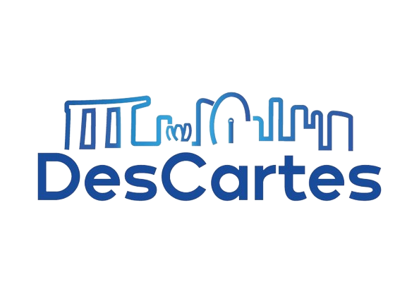

# Descartes Builder

  
Function + Data Flow GUI to create digital twin pipelines.  

# Dependencies

- Qt 6.4.0 and above
  - include Qt5compat module if not included by default
- C++ compiler
  - depends on OS (gcc for ubuntu, clang for macos, msvc for windows etc.)
- CMake
- Python 3.10

## Windows

- zlib (This projects uses QuaZip for handling zip operations)

## Ubuntu

- OpenGL dev
- python venv (for venv to have it's own pip, not necessary to build but for kedro to execute)
- xcb libraries
`sudo apt install libxcb-icccm4 libxcb-image0 libxcb-keysyms1 libxcb-render-util0 libxcb-xinerama0 libxcb-xkb1 libxkbcommon-x11-0 libxcb-cursor0 libxcb-cursor-dev`
- build tools for QT
`sudo apt install cmake build-essential libgl1-mesa-dev`
- zlib: `sudo apt install zlib1g-dev libbz2-dev`
- format: `sudo apt-get install libfmt-dev`
- vulkan: `sudo apt install vulkan-tools vulkan-validationlayers-dev libvulkan-dev`

## Optional

- CMake gui
- vscode
- extensions if using vscode:
  - CMake Tools
  - C/C ++ Extension Pack
- MSVC if on Windows

# Building

`cmake --build $BUILD_DIR --config Debug`

- replace `%BUILD_DIR` with your target build dir
- replace `Debug` with `Release` for release build
- these commands are usually generated by either vscode extensions or cmake gui
- during the first build you will need to provide the path to your Qt `path/to/qt/version/os/lib/cmake/Qt6` for example: `/Users/%USER/Qt/6.7.1/macos/lib/cmake/Qt6`

# CI Setup

The CI will automate the build process on window, ubuntu, and macos using GitHub Actions. It will follow the process described in the `.github/workflows/cmake_build.yml` file.

1. checkout repo
2. install python
3. install Qt
4. OS specific additional dependencies
5. configure cmake
6. build
7. run unit tests (temporarily disabled due to being unable to run on windows since windows requires dlls to run)
8. upload binary as artifact to GitHub

This process can be improved by creating pre-setup containers to build the code instead of setting up every run.

# Key Components and Files

## Key Components

### QtNodes

The core of the software depends on the QtNodes(paceholder/nodeeditor) library which handles the node, graph, connnection and UI logic. This software extends it to support direct acyclic graphs and further logical restrictions.

### Kedro

The backbone of the software is the execution engine which runs on Python. Kedro is a data science framework which this software will translate the graph to. Communication between the C++ software and python is handled through `QProcess`.

## Files

### During Execution

During execution, each tab of the software will create a `QTemporaryDir` which is a runtime directory storing all relavant files of that tab in a location depending on your OS. A template `builder-spring` is copied here from kedro_umbrella path. This kedro_umbrella path is fetched at run time every time, from the Python environment variable. This directory is split into 2 directories. The first is the `data` dir, which will contain any imported data files and the graph as a JSON (.dag). The second is the `kedro` dir, which stores the entire kedro project. When the tab is saved, the entire `data` folder is zipped as a `.dcb`.
